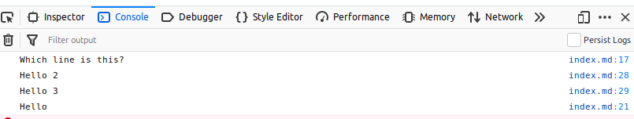

# Source map support:

## How to enable sourcemaps in your project

Let's say you are building either a web- or nodejs application:

You need to include the `source-map-support` library in your application

`npm install source-map-support` from https://github.com/evanw/node-source-map-support

At the start of your application:

`require('source-map-support').install()`

When compiling the application, please add the --sourcemaps option to 
your wlkc command:

`wlkc my-source.md -o build --sourcemaps`

That's all.


## How it works

Using the [Source map library from Mozilla](https://github.com/mozilla/source-map)
we can register chunks of code (which is content and their origin (file, linenumber)) information in a convenient way. At the end, the library will output
the file content and allows us to output a sourcemap file. I got this working
by playing around with the examples given in [this tutorial](https://hacks.mozilla.org/2013/05/compiling-to-javascript-and-debugging-with-source-maps/);

To see this in action i've set up [../tests/source-maps]. It will compile a small webapp (index.html, script.js, script.js.map), if you serve this using a simple
webserver and open developer tools, you'll see something like this:



Developer tools track the original lines accurately. 

Ideally, when clicking on a source reference (right side of the console.log lines, where it says index.md:17 for instance), it should highlight that line from index.md. That's not what is happening currently in firefox. 

There is some instructions about mapping sources here:
https://medium.com/@toolmantim/getting-started-with-css-sourcemaps-and-in-browser-sass-editing-b4daab987fb0


```js \
<< Program options >>+=
yargs.option('sourcemaps', {
    description: 'Output sourcemaps',
    default: false
});
```

Currently, only javascript and css files will get a sourcemap.

```js \
<< # Output sourcemaps >> 
if (argv.sourcemaps) {


    var appendSourceMappingURL = blockId.match(/\.(js|css)$/);
    if (appendSourceMappingURL) {

        let isJavascript = blockId.match(/\.js$/);   
        let mappingPiece = `sourceMappingURL=${blockId}.map`;

        if (isJavascript) {
            code += `\n//# ${mappingPiece}`;
        } else {
            code += `\n/*# ${mappingPiece}`;
        }

        renderedFiles[`${blockId}.map`] = {
            options: {},
            content: renderedContent.map.toString()
        }
    }
}

```
## Integrating it for nodejs binaries

https://github.com/evanw/node-source-map-support will allow us to install 
sourcemaps so that exceptions and such are reporting the correct locations
from markdown sources.


## Experiment

Documentation: 
https://github.com/evanw/node-source-map-support
https://github.com/mozilla/source-map

Tutorial: 
https://www.html5rocks.com/en/tutorials/developertools/sourcemaps/

Sourcemaps v3 spec (2011)
https://docs.google.com/document/d/1U1RGAehQwRypUTovF1KRlpiOFze0b-_2gc6fAH0KY0k/edit#

Step 1: Let the compiler also output a source map.

```js \
<< tmp/tryout-source-maps.js >> --skip
const SourceNode = require('source-map').SourceNode;

var sn = new SourceNode(1,1,"myfile.js", [
    new SourceNode(1, 1, 'myfile.js', 'line 1'),
    new SourceNode(2, 1, 'myfile.js', 'line 2'),
    new SourceNode(3, 1, 'myfile.js', 'line 3'),
    new SourceNode(4, 1, 'myfile.js', 'line 4'),
]);

var map = sn.toStringWithSourceMap({file: 'test.map.js'});

console.log(map, map.map.toString());

```

```action << #tryout-sourcemaps >> --skip
node tmp/tryout-source-maps.js
```

If we want to do this, the extract_blocks should export extra information,
about source files and start/end linenumbers of chunks. The groundwork has
been laid down...
